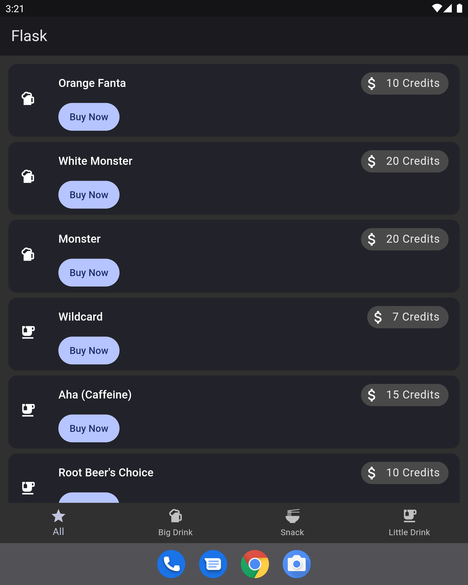

# Flask

A cute little Flutter app you can use to order items from the Computer Science House vending machines!

<p align="center" width="100%">
  
</p>

In code, Flask is called `devin` to avoid confusion with the
[Flask web framework of the same name](https://flask.palletsprojects.com/en/2.1.x/)

## Screenshots



## Installing Flask

You can get prebuilt versions of Flask from these places:

* Android
  * [Google Play Store](https://play.google.com/store/apps/details?id=edu.rit.csh.devin)
  * [F-Droid](https://f-droid.org/packages/edu.rit.csh.devin/)

## Building Flask

Building Flask is easy!

1. [Install Flutter](https://docs.flutter.dev/get-started/install)
2. Clone the repo:
```bash
git clone https://github.com/ComputerScienceHouse/devin.git
cd devin
```
3. Build Flask! This command will vary based on the platform you want. Here's an example of building an APK:
```bash
flask build apk --release
```
